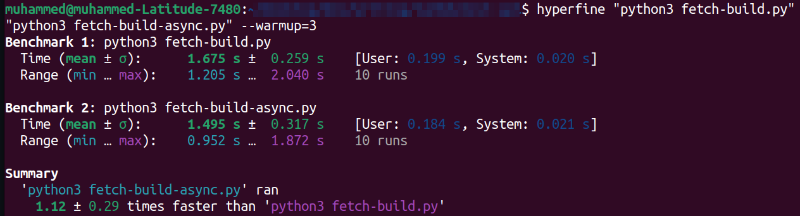

## What is this Repository about?
This repo contains example code of fetching test data from Lmbdatest API. The file `tests/fetch-build.py` contains code for fetching test data from Lambdatest API from a certain date range.`tests/fetch-build-async.py` shows how you can fetch data from an API synchronously using aiohttp.

## Running the code 
If you already have Python installed you only need to install dotenv which we will use to get the environment variables.
```bash
pip install python-dotenv
```
After installations create the environment variables in `.env` file and populate with you LambdaTest details.
```
# .env
LT_USERNAME=your_username
LT_ACCESS_KEY=your_access_key
```
You can benchmark the code files and you will see that the async version runs faster. For benchmarking (over a certain number of runs), we will use [hyperfine](https://github.com/sharkdp/hyperfine). Installation of hyperfine can be found in the [docs](https://github.com/sharkdp/hyperfine/blob/master/README.md#installation).
Benchmark by running the following command:
```bash
hyperfine "python3 fetch-build.py" "python3 fetch-build-async.py" --warmup=3
```


**Result: Asyncio is 1.12 ± 0.29 seconds faster than sync execution**. If we are working with more data and code the gap will be greater.
